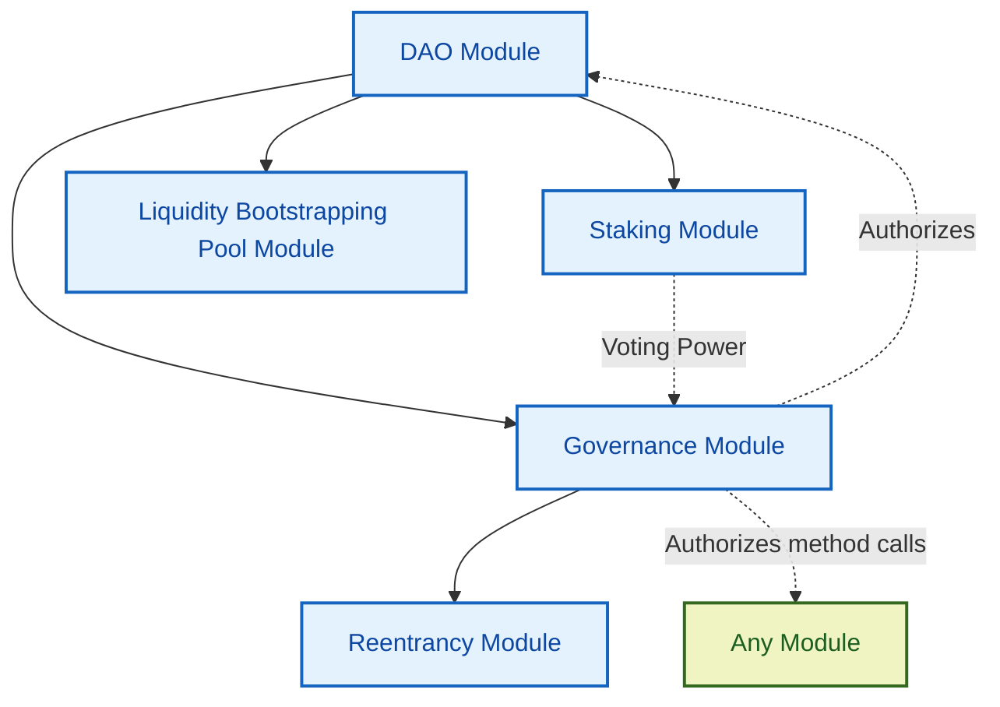

# stabilis_beta
 

```mermaid
graph TD
    DAO[DAO Module]
    Staking[Staking Module]
    Gov[Governance Module]
    Reent[Reentrancy Module]
    LBP[Liquidity Bootstrapping Pool Module]
    Any[Any Module]

    DAO --> Staking
    DAO --> Gov
    Gov --> Reent
    DAO --> LBP

    Gov -.-> |Authorizes| DAO
    Gov -.-> |Authorizes method calls| Any
    Staking -.-> |Voting Power| Gov

    classDef dao fill:#e3f2fd,stroke:#1565c0,stroke-width:2px,color:#0d47a1;
    classDef anyModule fill:#f0f4c3,stroke:#33691e,stroke-width:2px,color:#1b5e20;
    
    class DAO,Staking,Gov,Reent,LBP dao;
    class Any anyModule;
```
