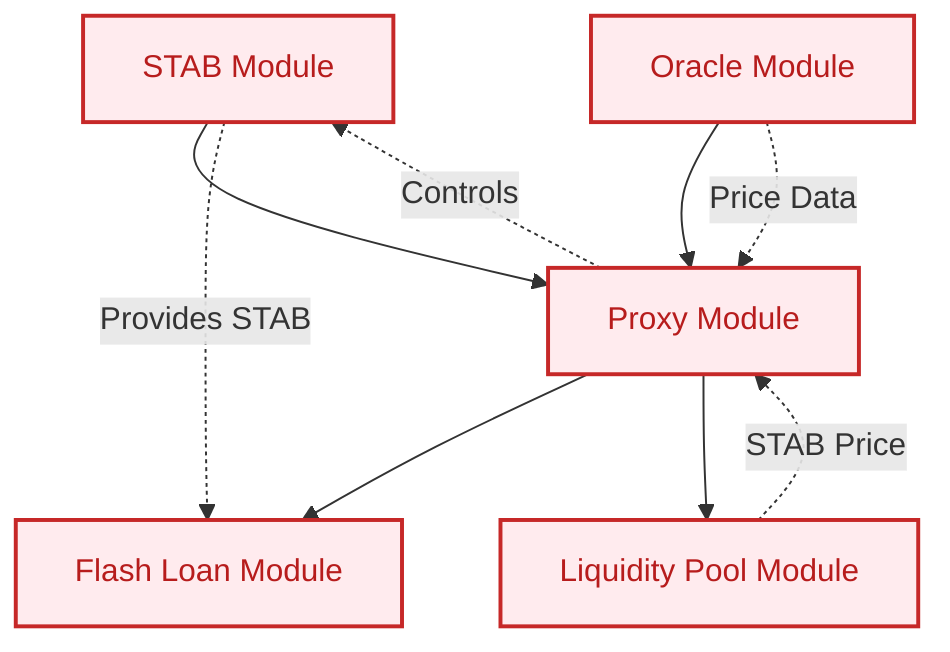
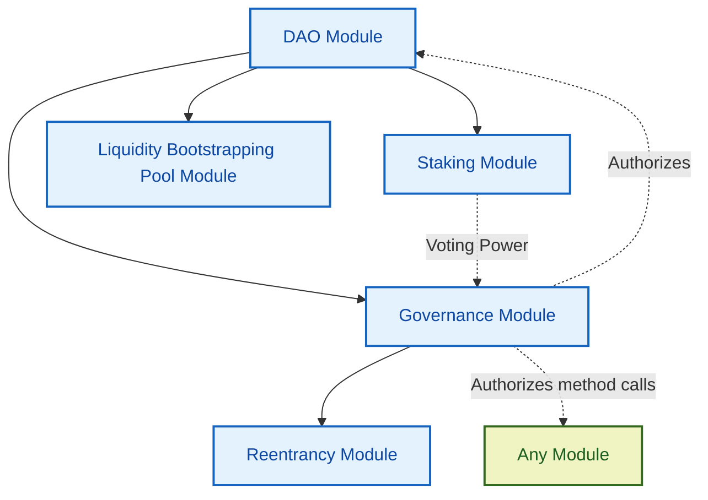
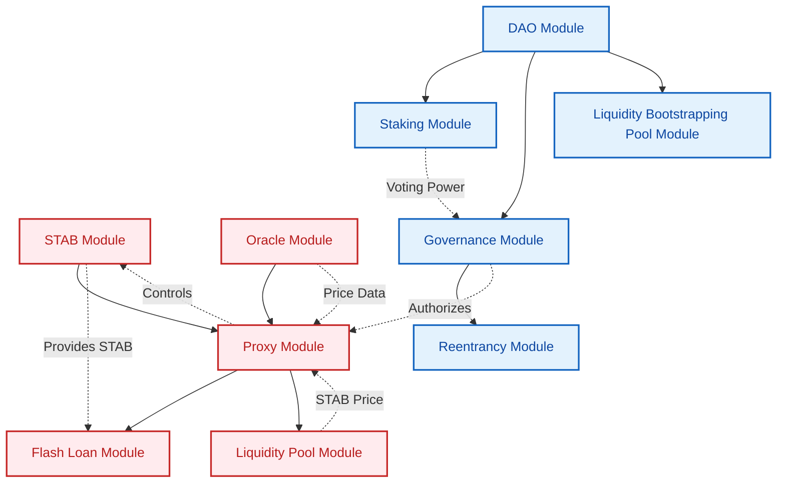

# Stabilis Protocol

The Stabilis protocol is a decentralized system for creating and managing a stablecoin called STAB, governed by a DAO (Decentralized Autonomous Organization). The protocol consists of two main parts: the STAB module and the DAO (ILIS) module.

## STAB Module

The STAB module is responsible for creating and managing the STAB token. It consists of several key components:

1. **Stabilis Component**: The core component that manages STAB token creation, loan operations, and liquidations. Users can open collateralized debt positions (CDPs) to borrow STAB tokens against accepted collateral.

2. **Proxy Component**: Acts as an intermediary for all interactions with the Stabilis component. It updates parameters like interest rates and collateral prices, ensures authorized access, and facilitates potential upgrades.

3. **Flash Loans Component**: Allows users to borrow STAB tokens for use within a single transaction.

4. **Stabilis Liquidity Pool**: A native STAB/XRD liquidity pool used to determine the price of STAB tokens.

5. **Oracle Component**: Aggregates external price data for use by the Proxy component.

### Key features of the STAB module include:

- Loan management (open, close, top up, borrow more, partial close)
- Liquidation process (marking, liquidating, retrieving leftover collateral)
- Interest rate adjustment using a PID controller to maintain the STAB peg
- Collateral price updates from oracles

## DAO (ILIS) Module

The DAO (ILIS) module governs the Stabilis protocol and can potentially control other components. It consists of:

1. **DAO Component**: Manages the DAO's treasury, distributes jobs and airdrops, and holds official DAO information.

2. **Governance Component**: Handles proposal creation, voting, and execution. It holds badges to authorize method calls suggested in proposals.

3. **Staking Component**: Allows users to stake any accepted token to a Staking ID NFT to receive governance tokens as a reward. Staking the protocol's governance tokens (ILIS) allows using the Staking ID NFT to vote on proposals.

4. **ReentrancyProxy Component**: Facilitates method calls that require reentrancy, which is challenging in the Radix Engine.

5. **Bootstrap Component**: Optionally creates a Liquidity Bootstrapping Pool (LBP) to distribute the DAO's governance token at launch.

### Governance Process

The Governance component is central to the DAO's operations, allowing users to create proposals, vote on them, and execute approved proposals. This process involves:

- Building proposals using ProposalSteps
- Submitting proposals using Proposal Receipts
- Voting on proposals using Staking IDs
- Executing approved proposals, which carries out each step in the proposal

The DAO can govern any number of components by executing authorized method calls on them, allowing for flexible control over the Stabilis protocol and potentially other systems.

# Architecture: Deploying the Stabilis Protocol

This section outlines the step-by-step process to deploy the Stabilis protocol, including both the STAB module and the DAO (ILIS) module. The total architecture of these modules is then displayed in a diagram.

## Deploying the STAB Module

To deploy the STAB module, follow these steps:

1. Instantiate the STAB module.
2. Instantiate the Oracle module.
3. Instantiate the Proxy module using the STAB module and the Oracle module.
4. The Proxy module automatically instantiates the Flash Loan module.
5. The Proxy module automatically instantiates the Liquidity Pool module (STAB/XRD pool).

After these steps, the STAB module of the system will be fully deployed. Here's a diagram representing the STAB module components and their interactions:

## Deploying the DAO (ILIS) Module

After the STAB module is deployed, you can proceed with deploying the DAO (ILIS) module:

1. Instantiate the DAO module.
2. The DAO module automatically instantiates the Staking module.
3. The DAO module automatically instantiates the Governance module.
4. The Governance module automatically instantiates the Reentrancy module.
5. The DAO module automatically instantiates the Liquidity Bootstrapping Pool module.

Here's a diagram representing the DAO (ILIS) module components and their interactions, including its ability to authorize method calls on any module:

## Connecting the DAO (ILIS) Module to the STAB Module

Once both modules are deployed, the DAO (ILIS) module will be connected to the STAB module. This connection allows the DAO to govern the STAB module through authorized method calls.

Here's a complete diagram showing both modules and their connections:

